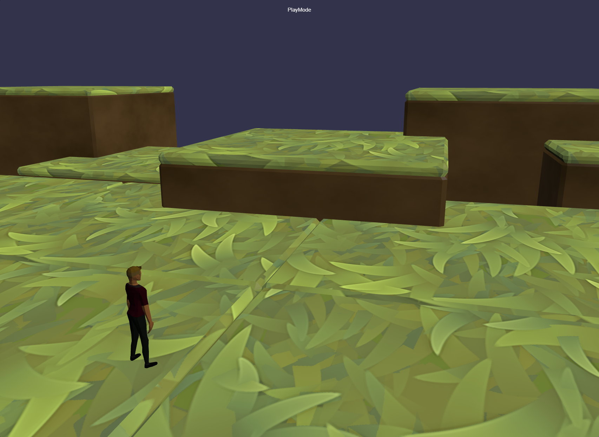

# Infinite Indie Sandbox
The aim of Infinite Indie Sandbox is to capture the eternal, endless dream of creating your own world and sharing it with others.

Inspired by the now defunct toys-to-life genre, but with an all-digital premise and open-source development.



# How to play
To run the game, you need to have PHP installed to use a local dev server.

### Mac OS
You should already have PHP installed. Double click `run.sh` to start the game server.

### Linux
You may already have PHP installed. Double click `run.sh` to start the game server. If there is an error or the window disappears, proceed to follow these steps:

#### Ubuntu
Run this command:
```
sudo apt -y install php-cli
```

**Now you can run it!**

Double click `run.sh` to start the game server.

### Windows
One-time setup for Windows:
* Go to [scoop.sh](https://scoop.sh/) and follow the instructions
* Double click `scoop-install-php.bat` to install PHP via Scoop

**Now you can run it!**
* Double click `run.bat` to run the game


## Controls
After the server is started, go to this URL:
[localhost:7001](http://localhost:7001/)

Currently, the game starts in build mode. The active mode is listed at the top of the screen.

To switch between modes, press the `Esc` key then to enter a new mode:

* Press `1` for Build mode
* Press `2` for Play mode


### Build Mode

* Press `Q` or `E` to move through the buildable objects list
* Press `W`,`A`,`S`,`D` to move the object around the world
* Press `R` or `V` to raise or lower the object
* Press `Z` or `C` to rotate the object
* Press Space key to place the object

Object snapping/alignment is currently a work in progress.

**Note:** There is no way to save a world yet.

### Play Mode
In play mode, a default avatar will be dropped into the world at the origin `(0,0,0)`.

Right now there is a placeholder cube there so the player will not fall through the world, place your objects around this so you can navigate to them.

Keys:

* Press `W`,`A`,`S`,`D` to move
* Hold down `Shift` to run
* Press `Space` to jump

## Contributing

Contributions in the form of source code, content, documentation, and example levels are welcome!

Please see [docs/contributing.md](docs/contributing.md) for details on required contributor agreements and other procedures.


## Code of Conduct
For details on our code of conduct, please see [docs/conduct.md](docs/conduct.md). All contributors are required to agree to the Code of Conduct Pledge as described in [docs/contributing.md](docs/contributing.md).
