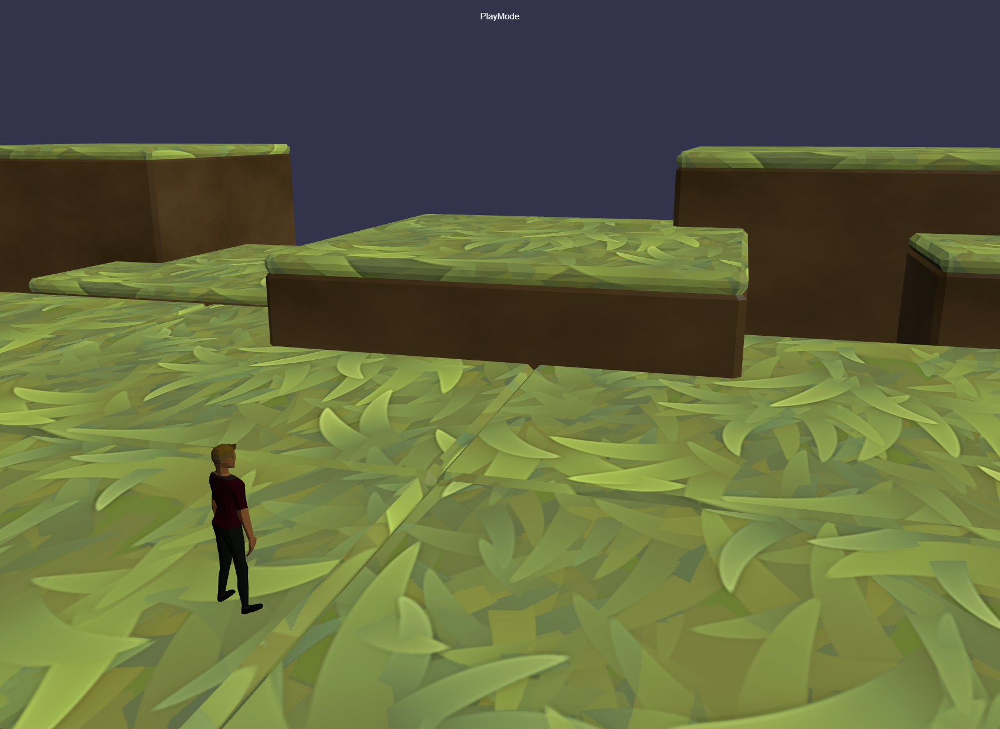

# Infinite Indie Sandbox
The aim of Infinite Indie Sandbox is to capture the eternal, endless dream of creating your own world and sharing it with others.

Inspired by the now defunct toys-to-life genre, but with an all-digital premise and open-source development.



# How to play
To run the game, right now you need to have PHP installed to use a local dev server. This will be replaced with a single-EXE HTTP server and WebView shell in a future update.

### Mac OS
You should already have PHP installed. Double click `run.sh` to start the game server.

### Linux
You may already have PHP installed. Double click `run.sh` to start the game server. If there is an error or the window disappears, proceed to follow these steps:

#### Ubuntu
Run this command:
```
sudo apt -y install php-cli
```

**Now you can run it!**

Double click `run.sh` to start the game server.

### Windows
One-time setup for Windows:
* Go to [scoop.sh](https://scoop.sh/) and follow the instructions
* Double click `scoop-install-php.bat` to install PHP via Scoop

**Now you can run it!**
* Double click `run.bat` to run the game


## Controls
After the server is started, go to this URL:
[localhost:7001](http://localhost:7001/)

Currently, the game starts in build mode. The active mode is listed at the top of the screen.

**New Game** opens a **starter-world picker**: Rolling Hills (the classic
gentle terrain), Flat Plane (a blank canvas), Arena (a walled floor for combat
games), Floating Islands (a platforming start), or the **Sandbox Hub** — a
pre-wired challenge park with four zones: a Combat Yard whose entrance wakes a
spawner (with a camera cut), a Star Climb that pays the scoreboard when you
collect all four stars, a Crossing bridged only by a moving platform (watch
the patrol on the far side), and a furnished Homestead with a sliding door
and a pocket-interior cell door. It doubles as a live tour of everything the
wiring system can do — open the Wiring view there and study the connections.

To switch between modes, press the `Esc` key then to enter a new mode:

* Press `1` for Build mode
* Press `2` for Play mode


### Build Mode

* Press the `Up`/`Down` arrow keys to switch object categories — the bottom
  bar shows only the selected category
* Press the `Left`/`Right` arrow keys to cycle through the objects in that
  category
* Press `W`,`A`,`S`,`D` to move the object around the world
* Press `R` or `V` to raise or lower the object
* Press `Z` or `C` to rotate the object
* Press `[` or `]` to scale the object
* Press `Space` to place the object
* Press `Delete` to remove the last placed object

Objects are placed centred under the cursor. Most objects rest their **base** on
the cursor (a tree sits *on* the surface), while **terrain** tiles snap their
**top** to the cursor — so a thin floor panel and a full terrain cube line up at
the same walking surface and tile together seamlessly. Use `R`/`V` to raise or
lower the object (and the whole surface height) before placing.

Some objects have **settings**: place a **Spawner** (Logic category) and a
parameters popup opens automatically so you can choose the enemy type, spawn
frequency and max-alive limit. To edit a placed object's settings later, enter
cursor mode (`0`), move the cursor over it and press `Space`.

#### Wiring: triggers → spawners

You can build simple gameplay by wiring interactive objects together. Place a
**Trigger** volume (Logic category) and a **Spawner**, then press `Esc` and
choose **Wiring**. The camera smoothly lifts to an overhead view showing only
the interactive objects, with 3D arrows drawn between wired objects:

* **Drag** from a source object (one that fires events — cyan outline) onto a
  target object (one that accepts actions) to connect them. If several
  event/action combinations fit, a chooser asks exactly which event drives
  which action.
* **Click a wire** to delete it. Every wire is labelled with what it carries
  ("Player Enters → Spawn One").
* A **guide panel** on the right explains the model and lists each object
  type's events (▸ fires) and actions (◂ accepts).

For example, wire a trigger's *Player Enters* to a spawner's *Spawn One* and set
the spawner to *Start on: no* — enemies then appear only when the player walks
into the trigger. Wires are saved with the world.

There's also a **Quest** toy: wire several different event sources into its
*Quest Step Done* input (a trigger, a counter's target, a race finish, a cell
door…) and it completes once all of them have fired — each source counts only
once, so it's "do these N different things". Completion pays a pixel reward
(set in its settings) and fires *Quest Complete* for further wiring. Dying
re-arms every quest for the next run. The Sandbox Hub starter world ships
with a 3-step "Tour the Park" quest to show the pattern.

The logic family also includes a **Counter** (fires *Target Reached* after a set
number of wired events — e.g. "after collecting 3 stars, spawn a boss"), a
**Timer** (fires *Tick* on a schedule, startable/stoppable by wires — e.g. timed
enemy waves), a **Scoreboard** (wired events score points, the score shows
on the play-mode HUD, and hitting the target fires *Target Reached* — build
your own minigame win conditions), and a **Camera** (a wired *Cut To This
Camera* moves the view to it for a few seconds — a cutaway that shows the
player what their trigger just did — then fires *Cut Finished*, so cameras can
chain into mini-cinematics). Chain them freely: trigger → counter → spawner,
timer → spawner, star → scoreboard, trigger → camera, and so on.

#### Interiors: rooms, doors, decoration

The **Interior** category is a room-building kit: solid walls, a wall with a
**doorway**, a wall with a **window**, and a wood **floor** panel (its top
snaps to the cursor like terrain, so room floors sit flush with the ground).
Walls block movement and shots; the doorway and window openings genuinely let
things through. The **Door** (Props category) is a sliding pocket door sized
to the doorway gap — in the Wiring view it accepts *Open* / *Close* /
*Open-Close* actions and fires *Opened* / *Closed* events, so a trigger or
counter can unlock a room (a settings option makes it start open instead).
Furnish with the **Decor** category: table, chair, floor lamp, and rug.

For a whole room behind a single door, place a **Cell Door** (Props) — its
glowing panel is a portal: walk into it in play mode and you're teleported
into a small decorated interior (its settings pick the theme, a cozy den or a
columned hall). Step on the glowing exit pad to return to where you entered.
While you're inside, enemies outside politely freeze. The door fires *Player
Entered* / *Player Exited* wiring events, so entering a room can start timers,
cut cameras, or count visits.

#### Paths and moving platforms

Place **Path Node** markers (Logic category) and chain them in the Wiring
view — wire each node's *Next Node* to the following node's *Chain From
Previous*. Then place a **Moving Platform** (Props) and wire its *Follow Path
From* to the first node: in play mode the platform travels the chain at its
configured speed, in **loop**, **ping-pong**, or **once** mode. Wires can
*Start*/*Stop*/*Reset* it, it fires *Arrived At Node* and *Path Completed*
events (drive counters, spawners, cameras…), and dying resets it to the path
start. Note: the platform pushes things in its way, but doesn't carry riders
yet — use it for sweepers, barriers, and timed crossings.

**Enemy patrols:** wire an `en_blob`'s *Patrol Path From* to a path node the
same way and it walks the chain (its settings choose speed and loop vs
ping-pong). When you get close it stops and watches you; back away and the
patrol resumes.

**Races:** place a **Race** toy (Logic) and wire trigger volumes into it — one
as the *Start Gate*, any number as *Checkpoints* (its settings say how many
the course needs), and one as the *Finish Line*. Running through the start
arms a stopwatch on the HUD; the finish only counts once every checkpoint has
been hit (each one counts once, so laps through the same gate don't cheat).
Finishing fires *Race Finished*, and beating your best fires *New Best
Time* — wire those to scoreboards, cameras, or spawners to celebrate. Best
times are stored with the course, so they persist in your world's save slot.

#### Pickups

The **Pickups** category has placeable collectables that bob and spin in play
mode and are collected by touch: **health packs** (restore HP), **pixel caches**
(grant currency), and **stars** (collectibles). Each has settings for the
amount and whether it respawns after a delay or is one-time. Pickups fire a
*Collected* wiring event, so collecting one can drive spawners, counters, and
timers.

#### Select / move placed objects

* Press `0` to enter cursor (select) mode
* Move the cursor (`W`,`A`,`S`,`D`) over a placed object to highlight it
* Press `Enter` to pick it up and move it (then `Space` to drop it back)
* Press `Delete` to remove the highlighted object

**Saving:** Press `Esc` and choose Save Game / Load Game to store worlds in
save slots.

**Sharing:** the main menu's **Share Worlds** screen exports your current
world as a `.json` file you can send to anyone, and imports world files you
receive (the game checks they really are world files first). Imported worlds
open straight into build mode.

### Play Mode
In play mode, a default avatar will be dropped into the world at the origin `(0,0,0)`.

Right now there is a placeholder cube there so the player will not fall through the world, place your objects around this so you can navigate to them.

Keys:

* Press `W`,`A`,`S`,`D` to move
* Hold down `Shift` to run
* Press `Space` to jump — press again mid-air for a **double jump**, and
  **hold** `Space` while falling to **glide** down slowly
* **Left click** for a melee attack (also `F` for keyboard-only play)
* **Right click** for a ranged attack — the character turns to aim their hand and
  fires a neon shot toward the cursor
* Press `T` to **lock on** to the nearest enemy (a marker floats above it);
  ranged shots then track that target until it's defeated or you press `T` again
* Hold `G` to **block** — a shield raises in front of you and attacks from the
  front deal no damage (attacks from behind still hurt, so keep facing the threat)
* Press `C` to **dodge roll** — a quick burst of movement in the direction
  you're moving (or a back-hop if standing still); anything that hits you
  mid-roll is ignored entirely. There's a short cooldown between rolls.

**Combos:** land melee swings back-to-back to chain a 3-hit combo — the third
hit is a finisher that deals triple damage.

**Juggling:** press `R` for a **launcher** — an upward swing that knocks
enemies in front of you into the air. While they're airborne every hit deals
**+1 bonus damage** and pops them back up, so launch → swing → swing keeps
them helpless in the air (the HUD celebrates your juggle chain). Walkers
ragdoll up and crash back down; flyers tumble. Launched enemies can't attack
until they land.

Aim the ranged shot with the mouse; a gamepad auto-aims at the locked/nearest enemy.

**Gamepad:** full pad play is supported. The **left stick** moves, the
**right stick** orbits the camera, and **A** jumps (hold to glide, tap again
mid-air to double-jump). `X` or the left trigger swings melee, the right
bumper/trigger shoots, `B` dodge-rolls, `Y` fires your figure's special,
holding `LB` blocks, and clicking the right stick toggles lock-on.

### Survival

A brand-new sandbox starts **empty and peaceful** — no enemies spawn on their
own. Enemies appear only from things you place: drop an `en_blob` enemy, or a
**Spawner** (Logic category) configured to produce neon **TRON-style enemies**.
There are flying polyhedra (melee) and **bipedal walkers** that fall and walk on
the terrain (using the same gravity as the player) and attack with both melee
and ranged neon shots. Attack them with `F` before they wear down your health
bar (top-left); if your health hits zero you respawn.

### Levelling up

Defeating enemies also grants **XP**. Your character levels up (to level 20,
shown top-left with an XP bar): each level adds max HP, and every 5 levels
adds +1 melee damage. Progress persists between sessions, like pixels.

Every level-up also grants a **skill point**. Press `Esc` → **Skills** to spend
points on four skills: **Vitality** (+10 max HP per rank), **Power** (+1 melee
damage), **Trigger** (faster ranged fire), and **Agility** (shorter dodge
cooldown). Skill ranks are per-figure, persist like XP, and can be reset for
free at any time from the same screen.

### The Collection (figures)

The **Collection** screen (main menu, or `Esc` → Collection in game) is your
figure roster. Figures are colorways of the avatar with their own stat leans —
Scout (balanced, free), Blaze (+1 melee), Frost (+25 max HP), and Volt (faster
ranged fire) — bought à la carte with pixels. Each figure also has a
**signature special** on `V` (about a 5-second cooldown): Scout's
**Shockwave** blasts and launches everything around you, Blaze's **Flame
Arc** is one heavy frontal strike, Frost's **Nova** freezes nearby enemies in
place, and Volt's **Chain Bolt** fires a fan of five shots. Each figure **levels up
independently**: switch figures and you switch to that figure's saved
level and XP. The HUD badge shows who you're playing and their level.

### Sidekicks

The Collection screen also lists **sidekicks** — small companions you adopt
with pixels (Wisp, Pebble, or Spark). One follows you at a time, hovering at
your shoulder. Your sidekick earns **half of every XP drop** you collect and
levels up on its own curve (to level 10); each of its levels adds **+2 max
HP** to you while it follows. Impatient? **Feed it** (10 pixels for 10 XP)
from the Collection screen. Each sidekick keeps its own progress, and
re-selecting the active one sends it home for a while.

### Power Discs

The Collection screen also opens your **Power Discs** (`9` from the roster) —
buyable buff tokens that work with **any** figure: Ember Sigil (+1 melee),
Aegis Shell (+20 max HP), Swift Coil (faster dodge), Fortune Prism (+25%
pixels), and Sage Lens (+25% XP). You can equip **two at once**, and two
different discs stack — pick a pair that fits your build. Discs persist like
pixels and follow you across figure switches.

Below the round discs live the **hex discs** — world themes that recolor the
sky and terrain everywhere: Classic Meadow (free), Midnight Vale, Emberfall,
and Verdant Haze. One is active at a time; pick a mood for your sandbox.

### Pixels & the Shop

Defeated enemies burst into **pixels** — tiny multi-coloured cubes that fly to
you and are added to your pixel count (shown top-right). Spend pixels in the
**Shop** (`Esc` → Shop) to unlock premium objects. Objects you don't own can
still appear and work in a world in play mode, but they're locked in build mode
(shown with a price in the object bar) until you buy them.

The shop also sells **packs** — bundles of figures and premium objects at a
discount (the listing shows how much you save): the **Hero Pack** (all three
premium figures) and themed **Play Sets** that pair a figure with matching
objects. Buying a pack grants everything in it you don't already own, and a
pack shows as owned once you have all its contents, however you got them.

## Contributing

Contributions in the form of source code, content, documentation, and example levels are welcome!

Please see [docs/contributing.md](docs/contributing.md) for details on required contributor agreements and other procedures.


## Code of Conduct
For details on our code of conduct, please see [docs/conduct.md](docs/conduct.md). All contributors are required to agree to the Code of Conduct Pledge as described in [docs/contributing.md](docs/contributing.md).
